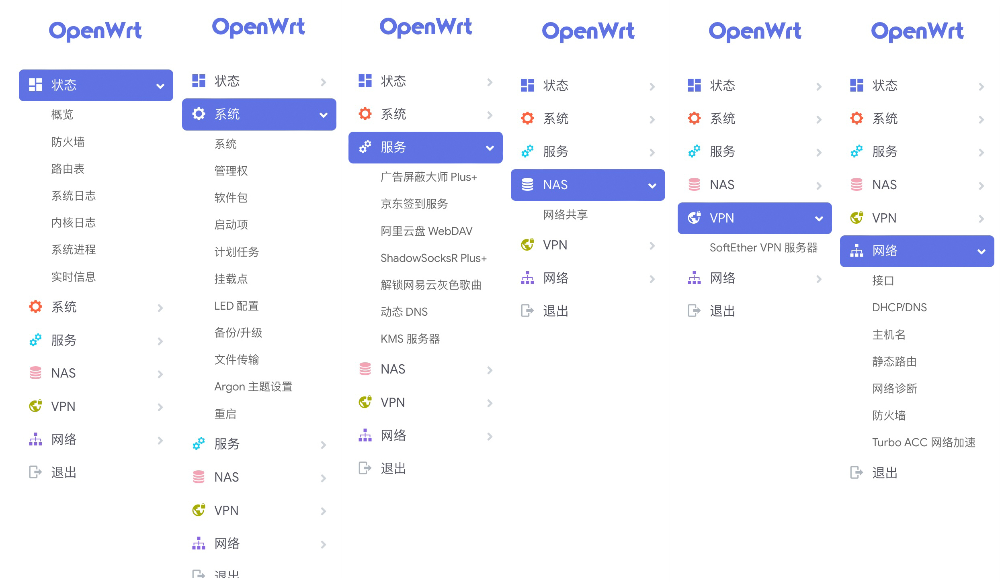

### 介绍 

- 借助 GitHub Actions 的 OpenWrt 在线集成自动编译.
- IP:192.168.1.1
- 密码无

  
### 下载
- [Releases](https://github.com/vpnshopee/OpenWrt_Personal-V01/releases) 或 [Actions](https://github.com/vpnshopee/OpenWrt_Personal-V01/actions)

### 感谢

- 感谢[P3TERX](https://github.com/P3TERX/Actions-OpenWrt) 脚本。  
- 感谢[Lean](https://github.com/coolsnowwolf/lede) 源码。  
- 感谢[jerrykuku](https://github.com/jerrykuku) argon主题。 
